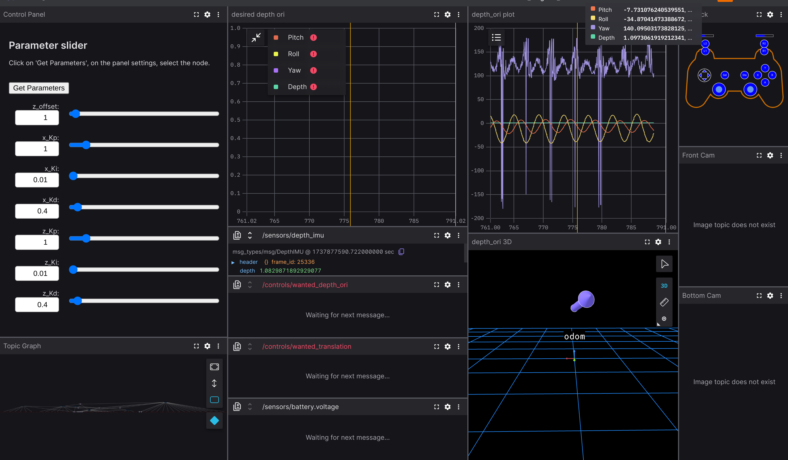

# Setup

Always remember to run `source /opt/ros/humble/setup.bash`

## File Structure
The files on this repo should be placed in the SRC folder of your hornet workspace
E.g.
 - HornetXAuV_ws
    - src
        - h10_controls
            - controls_movement
            - launch_files

## Steps to get started

1. Use `mkdir` to make your own src folder
2. `cd` into `src` and `mkdir h10_controls`
2. `cd h10_controls` and git pull the stuff into there
3. `cd ../..` and then from HornetXAuv_ws run
4. `colcon build`
5. `source install/setup.bash`
6. `ros2 run controls_movement vertPID`
7. Alternatively, (under construction) run `ros 2 launch launch_files pool_test.launch.py`

After completing the above steps your file structure will look like

 - HornetXAuV_ws
    - build
    - install
    - log
    - src
        - h10_controls
            - controls_movement
            - launch_files


## code changes for foxglove control panel:
### Made changes to replace the old cv2 control panel, tested without jetson on local environment, may need to change some things to work with jetson.

1. create config yaml file for the values you want to update, its control limits, and its location from the package, refer to [sample_pid_yaml](/src/h10_controls/controls_movement/config/pid.yaml).  
    - name of main parameter should not contain min, max, step as those will be used for slider configuration. 
    - values must be floating point
    - there must be exactly sets of <value, value_min, value_max, value_step> for each sliding parameter, location parameters are ignored from the control panel

2. create ros launch file for the node that need control panel and add the config file under parameters of that node, refer to [sample_launch_file](controls_movement/launch_files/fake_pid.launch.py), for running 2 nodes/files that both need control panel see [quali_gate.launch.py](controls_movement/launch_files/quali_gate.launch.py)

3. at the beginning of the node, add these lines to automatically declare all the parameter values so that this ros parameters will be active.
    ```
    package_directory = get_package_share_directory('controls_movement')
    self.declare_parameter('config_location', rclpy.Parameter.Type.STRING)
    config_location = package_directory + self.get_parameter('config_location').get_parameter_value().string_value
    self.declare_parameters(namespace='', parameters=read_pid_yaml_and_generate_parameters(nodename, config_location))
    ```
    to retrieve the values:
    ```
    self.get_parameter(<parametername>).get_parameter_value().double_value
    ``` 


## Running foxglove
### On Jetson
Install foxglove ros package and run foxglove bridge
```
sudo apt install ros-$ROS_DISTRO-foxglove-bridge 
ros2 launch foxglove_bridge foxglove_bridge_launch.xml
```

### On local computer
1. Install [foxglove](https://foxglove.dev/download)
2. Download [foxe file](https://github.com/ZealousGinger/foxglove-parameter-slider)
3. open foxglove > settings > user settings > extensions > install local extension > select unknown.control-panel-0.0.0.foxe
4. Click on get parameter, then click on panel settings(gear icon) select the node to display. the parameter sliders should appear

tested on own computer with fake allocator and able to modify the parameters from foxglove:
```
ros2 launch controls_movement fake_pid
```
## Additional files
- controls_movement/imu2pose for 3D visualisation of robot depth and orientation
- config/foxglove_dashboard.json: json config file for foxglove dashboard
- joy controller extension panel (need subscriber on robot) > open foxglove > go settings > extensions > Joystick Panel Josh Newans 0.0.3 Foxglove panel extension for joystick/gamepad control. > Install 
### Foxglove dashboard should look like this
